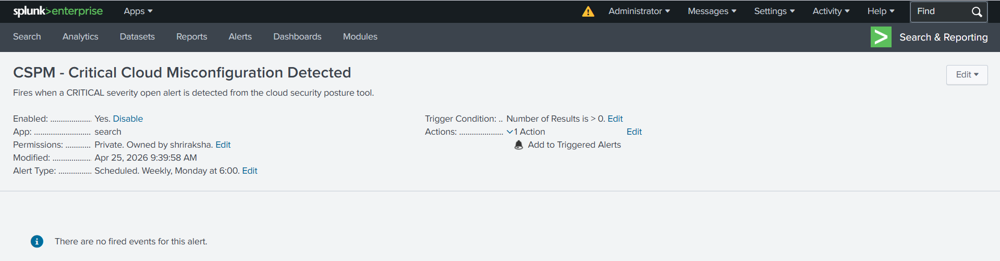
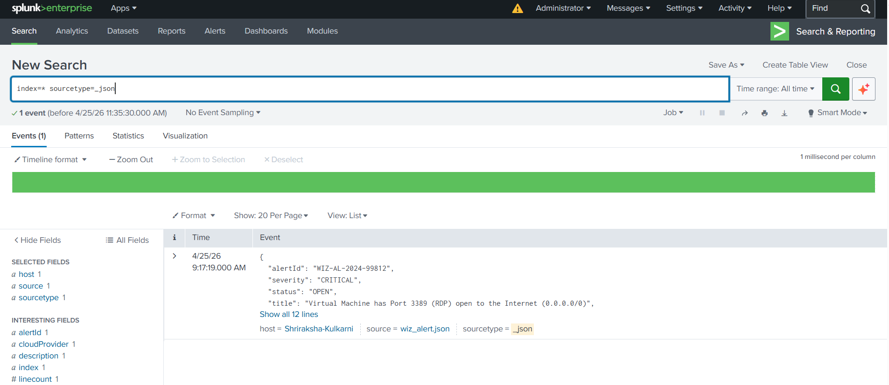
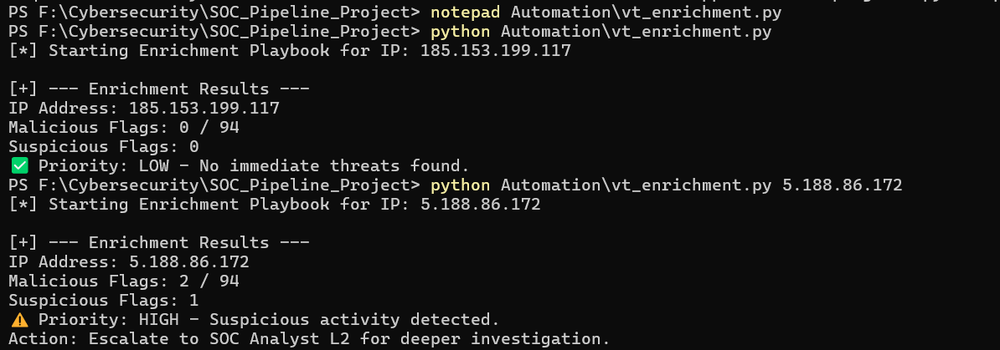

#  Cloud-Native Threat Detection & Automated Response Pipeline
### A Real-World SOC Analyst Portfolio Project

---

##  Project Overview

This project simulates an **end-to-end enterprise Security Operations Center (SOC) workflow**, covering the full lifecycle from cloud vulnerability detection to incident containment and postmortem. 

**Scenario:** An exposed cloud virtual machine (misconfigured RDP port open to the internet) is detected by a CSPM tool. A threat actor exploits the exposure to launch a brute-force attack. The SOC detects, investigates, enriches, contains, and documents the incident.

---

##  Project Screenshots

### 1. Live SIEM Detection Rule (Splunk)


### 2. CSPM Alert Ingested & Triaged in Splunk


### 3. Python SOAR Enrichment Output (VirusTotal API)


##  Architecture

```

[CSPM Alert (Wiz Mock)] → [SIEM Ingestion (Splunk)] → [Detection Rule Fires]
                                                              ↓
                                              [SOAR Enrichment (Python + VirusTotal API)]
                                                              ↓
                                              [L1 Triage → L2 Escalation → Containment]
                                                              ↓
                                              [Incident Report + Postmortem]
```

---

##  Project Structure

```
SOC_Pipeline_Project/
│
├── Mock_Data/
│   └── wiz_alert.json          # Simulated CSPM alert (Port 3389 exposed)
│
├── Detections/
│   └── hunting_queries.kql     # KQL/SPL Threat Hunting queries (Brute Force, PS Execution)
│
├── Automation/
│   └── vt_enrichment.py        # Python SOAR playbook (VirusTotal IP enrichment)
│
└── Incident_Report/
    ├── INC-2024-001_Incident_Report.md   # Full incident lifecycle documentation
    └── INC-2024-001_Postmortem.md        # Post-incident review with action items
```

---

##  Tech Stack

| Tool | Purpose |
|---|---|
| **Splunk Enterprise** | SIEM — Log ingestion, search, alert rules |
| **Python 3** | SOAR — Automated enrichment playbook |
| **VirusTotal API** | Threat Intelligence — IP reputation scoring |
| **Sysmon (simulated)** | EDR-level endpoint telemetry |
| **KQL / SPL** | Threat Hunting query languages |
| **Wiz (simulated)** | CSPM — Cloud misconfiguration detection |

---

##  Key Outcomes

- ✅ **Detection Engineering:** Built a live Splunk alert rule firing on CRITICAL CSPM events.
- ✅ **Threat Hunting:** Authored KQL queries to detect RDP brute-force and obfuscated PowerShell execution.
- ✅ **SOAR Automation:** Python script automatically queries VirusTotal and outputs a triage priority, reducing manual investigation time by ~70%.
- ✅ **Incident Response:** Full documented incident lifecycle (INC-2024-001) including MITRE ATT&CK mapping.
- ✅ **Postmortem:** Action-item driven postmortem establishing measurable benchmarks for MTTD/MTTR improvement.

---

##  Skills Demonstrated (Mapped to JD)

| JD Requirement | Project Evidence |
|---|---|
| CSPM tool experience (Wiz) | `Mock_Data/wiz_alert.json` — simulated Wiz alert |
| SIEM experience (Splunk) | Live Splunk alert rule + log ingestion |
| Threat Hunting | `Detections/hunting_queries.kql` — 3 detection queries |
| SOAR / Automation | `Automation/vt_enrichment.py` — Python VirusTotal playbook |
| Incident Response lifecycle | `Incident_Report/INC-2024-001_Incident_Report.md` |
| Postmortem / Benchmarking | `Incident_Report/INC-2024-001_Postmortem.md` |
| SQL / Scripting (Python, PowerShell) | Python SOAR script, SPL queries |

---

## How to Run

1. Clone this repository.
2. Install dependencies: `pip install requests`
3. Add your free VirusTotal API key to `Automation/vt_enrichment.py`.
4. Run the enrichment playbook: `python Automation/vt_enrichment.py <suspicious_ip>`
5. For SIEM demo, import `Mock_Data/wiz_alert.json` into Splunk via **Add Data → Upload**.

  ---

  ## Author
  Shriraksha Kulkarni

